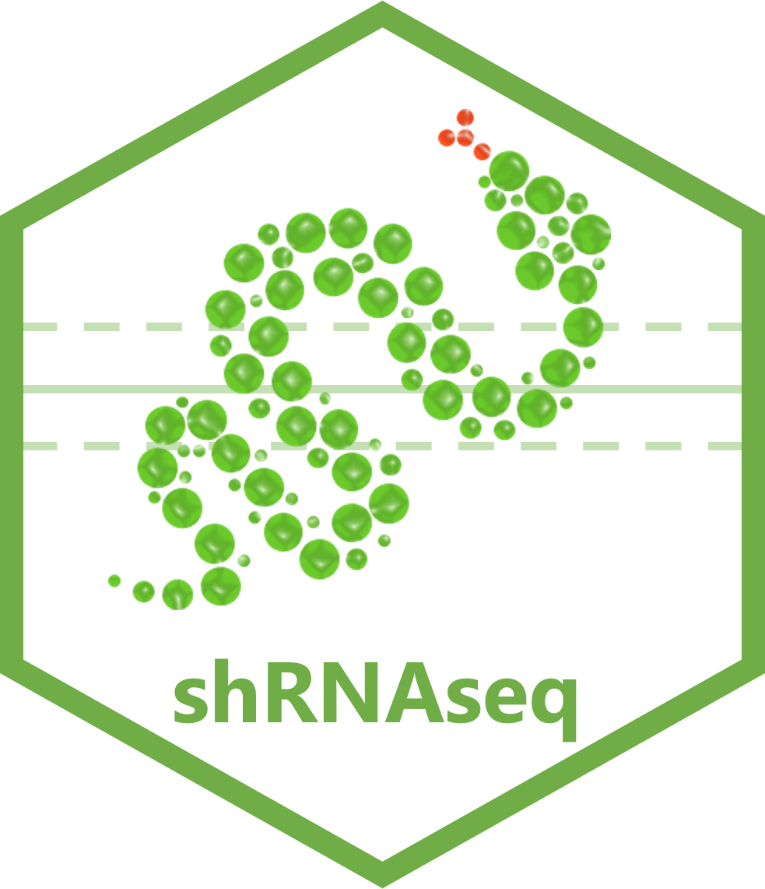

# shrnaseq 

Snakemake workflow of shRNA-seq and CRISPR-Cas9 genetic screen analysis using edgeR.

[](https://snakemake.github.io)
[](https://github.com/zifornd/shrnaseq/actions)
[](https://github.com/tterb/atomic-design-ui/blob/master/LICENSEs)

## Table of Contents

* [Overview](#overview)
* [Installation](#installation)
* [Usage](#usage)
* [Shiny application](#shiny-application)
* [Documentation](#documentation)
* [Contributing](#contributing)
* [Authors](#authors)
* [Acknowledgements](#acknowledgements)
* [License](#license)

## Overview

This workflow is used to analysis shRNA-seq and CRISPR/cas9 genetic screens. The workflow is built in [Snakemake](https://snakemake.readthedocs.io/en/stable/), a workflow managament system. It primarily uses [edgeR](https://bioconductor.org/packages/release/bioc/html/edgeR.html), a Biocondutor R package which allows for differential expression analysis of RNA-seq expression profiles. The workflow performs data processing, quality control, differential expression analysis, gene set testing and gene enrichment, with batch correction implemented. 

## Installation

Install snakemake using the mamba package manager:

```bash
$ mamba create -c conda-forge -c bioconda -n snakemake snakemake

$ mamba activate snakemake
```
    
Pull the workflow to your project directory:

```bash
$ git pull https://github.com/zifornd/shrnaseq
```
    
## Usage

Configure the workflow by editing the `config.yaml` file:

```console
$ nano config/config.yaml
```

Run the workflow: 

```console
$ snakemake --use-conda --cores all
```
For further details on Snakemake, see the [Snakemake documentation](https://snakemake.readthedocs.io/en/stable/).

Alternatively, the [Dockerfile](./Dockerfile) can be used to run the workflow in a container.

## Shiny application

The output of this workflow can be visualised in Shiny from RStudio, see the [shRNAseq shiny documentation](https://github.com/zifornd/shrnaseq-shiny).

## Documentation

See the [Documentation](workflow/DOCUMENTATION.md) file for configuration and output information.

## Contributing

See [CONTRIBUTING.md](CONTRIBUTING.md) for ways to get started.

Please adhere to this project's [code of conduct](CODE_OF_CONDUCT.md).

## Authors

- [Claire Prince](https://github.com/prince-claire)
- [James Ashmore](https://github.com/jma1991)
- [Joseph Smith](https:://github.com/joekitsmith)

## Acknowledgements

This workflow is based on the following research article:

```
Dai Z, Sheridan JM, Gearing LJ et al. edgeR: a versatile tool for the analysis of shRNA-seq and CRISPR-Cas9 genetic screens [version 2; peer review: 3 approved]. F1000Research 2014, 3:95 (https://doi.org/10.12688/f1000research.3928.2)
```

using the Snakemake management system:
 
```
Mölder F, Jablonski KP, Letcher B et al. Sustainable data analysis with Snakemake [version 2; peer review: 2 approved]. F1000Research 2021, 10:33 (https://doi.org/10.12688/f1000research.29032.2)
```

## License

This workflow is licensed under the [MIT](LICENSE.md) license.  
Copyright &copy; 2022, Zifo RnD Solutions
